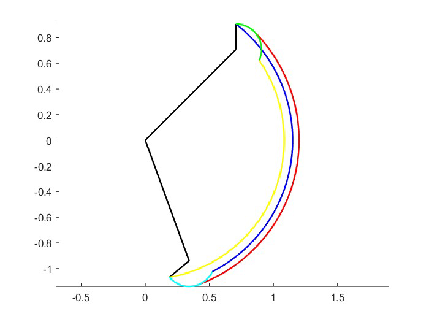

# Optimal Kinematic Design of Robots – SCARA Workspace Design

**Author:** Anna Possamai  
**Instructor:** Philippe Wenger  
**Department:** Control and Robotics Engineering  
**Date:** October 18, 2023  

---

## Introduction

This repository contains the MATLAB implementation for **Workspace-based Design of a SCARA Robot**. The lab demonstrates how to use the concept of **workspace** in the design of an interactive MATLAB function for a SCARA robot, taking into account joint limits, link lengths, and obstacles.

---

## Work Plan

### 1. Direct Kinematics and Singularities
- The direct kinematics model was computed to determine the end-effector position as a function of joint angles:
  
$$
\begin{cases}
x = a_1 \cos(q_1) + a_2 \cos(q_1 + q_2) \\
y = a_1 \sin(q_1) + a_2 \sin(q_1 + q_2)
\end{cases}
$$

- The Jacobian was used to identify joint singularities, which occur at `q2 = 0` and `q2 = π`.

### 2. Workspace Analysis
- **Main function:** `main_workspace.m` allows users to input joint limits and link lengths to visualize the robot's workspace.
- **Workspace without obstacle:** `workspace(l1, l2, q1min, q1max, q2min, q2max)` calculates the workspace boundaries using the direct kinematics function `dkm(l1, l2, q1, q2)` which takes link lengths and joint limits as inputs and outputs the corresponding `(x, y)` coordinates.

*Figure 1: Workspace boundaries, without obstacle*

The Figure 1 shows the workspace boundaries for $l1 = 1$, $l2 = 0.2$, with joint limits $-70 ≤ q1 ≤ 45$ and $-70 ≤ q2 ≤ 45$. Colored lines indicate the end-effector paths: yellow for q1 varying at $q2 = q2_{min}$, blue at $q2 = q2_{max}$, red at $q2 = 0$ (fully extended), blue at $q1 = q1_{min}$, and green at $q1 = q1_{max}$ with $q2$ varying.

- **Workspace with obstacle:** `workspace_obst(l1, l2, q1min, q1max, q2min, q2max, xo, yo, ro)` considers a disk-shaped obstacle that obstructs link 1, calculates joint limits to avoid collisions, and plots the restricted workspace.
- The function takes link lengths `l1`, `l2`, joint limits `q1min`, `q1max`, `q2min`, `q2max`, and the obstacle’s position and radius `(xo, yo, ro)` as inputs.

It first checks whether the obstacle obstructs link 2. If it does, an error is displayed and no workspace is plotted; otherwise, the robot’s workspace is generated.

*Figure 2: Condition of no obstruction of link 2*

The obstruction condition is determined by checking if:
$$ ||X_obst|| + r_o ≥ (l1 - l2)$$

To handle link 1, possible intersections with the obstacle are analyzed (points A and B in Figure 3). The robot halts link 1 movement when it reaches the obstacle, and the joint 1 limits are adjusted accordingly:

$$
q_{1max\_o} = \theta_{obst} + \alpha, \quad q_{1min\_o} = \theta_{obst} - \alpha
$$

where

$$
\theta_{obst} = \text{atan2}(y_o, x_o), \quad
\alpha = \text{atan2}(r_o, l_t), \quad
l_t = \sqrt{x_o^2 + y_o^2 - r_o^2}
$$

*Figure 3: Angle limits condition*

Next, the direct kinematic model `dkm(l1, l2, q1, q2)` is used to compute (x, y) coordinates within the adjusted joint limits, and the workspace is plotted. Links are shown in black and the obstacle in red, demonstrating how the obstacle restricts the workspace.

*Figure 4: Workspace boundaries, links and obstacle*

Currently, the code only handles the case where both `q1` limits intersect the obstacle. Other scenarios, such as when only one limit intersects, are not managed and would require future implementation.

---

Fino a qui

## Design for Point-to-Point Tasks
- SCARA robot joint limits: `±132°` (θ1), `±141°` (θ2).  
- Obstacle: disk with radius `0.3 m` at `(1.2, 0.1) m`.  
- Robot's maximum reach: `2 m`.  
- Goal: find the optimal link length ratio for picking parts from an **L-shaped palette** (2 m × 1 m, width 0.5 m) and placing them into another identical palette. In pick-and-place tasks, the robot may encounter temporary singularities, but these are manageable since only point-to-point movements are required.
- Optimal link lengths: `l1 = 0.9 m`, `l2 = 1.1 m`.  
- The configuration allows the robot to reach all points on the L-shaped palette for **pick-and-place tasks**, with temporary singularities not posing an issue.

To maximize the workspace, two constraints were considered: the end-effector maximum reach `l1 + l2 ≤ 2`, and obstacle avoidance for `l1`, ensuring `d_o - r_o ≥ l1`, where `d_o` is the distance to the obstacle center and `r_o` its radius.  

If `l1 > d_o - r_o`, the workspace would split into two parts because link 1 cannot pass through the obstacle (Figure 5). The optimal link ratio is generally 1, balancing reach and obstacle clearance.

*Figure 5: Workspace boundaries, links and obstacle*

Following these constraints, the chosen link lengths are `l1 = 0.9 m` and `l2 = 1.1 m`, allowing the robot to reach all points of the L-shaped palette. The palette is rotated by -90° to fit into the workspace.

*Figure 6: Workspace boundaries for pick and place task*

This configuration enables full pick-and-place coverage of the L-shaped palette. Temporary singularities may occur during movement, but they do not affect this point-to-point task.

---

## Design for Process Tasks

Process tasks present challenges due to singularities, where small joint variations can cause large deviations in the end-effector (x, y) position. Singularities often occur when the robot's arms are fully extended (`q2 = 0`), especially during a switch from "elbow up" to "elbow down" configuration.

In applications like laser processing, crossing singularities can cause unintended movements, loss of control, or trajectory disruptions. Thus, it is crucial to avoid singularities in these tasks.

Consider the scenario in Figure 7: the upper part shows an "elbow up" configuration and the lower part an "elbow down" configuration. Traversing a singularity to change configuration is not ideal for the robot.

*Figure 7: Configuration to avoid*

The workspace from the previous exercise is suitable for link lengths used. By analyzing the joint space and L-shape placement, this configuration prevents the robot from crossing singularities while following the shape's contours (Figure 8).

*Figure 8: Workspace boundaries for process task*

---

## Conclusion
- This lab demonstrates **workspace analysis**, **singularity identification**, and **MATLAB function development** for SCARA robots.  
- The repository includes tools for visualizing the robot's workspace with or without obstacles.  
- Optimized link lengths allow the robot to perform both **point-to-point pick-and-place** and **process tasks** efficiently.  

---

## Files in the Repository
- `main_workspace.m` – main script to visualize workspace  
- `workspace.m` – function for workspace boundaries without obstacles  
- `workspace_obst.m` – function for workspace boundaries with obstacle  
- `dkm.m` – direct kinematics function  
- Other MATLAB scripts for plotting, calculations, and demonstrations  
- `README.md` – this file  

---

## Usage
1. Open MATLAB and navigate to the repository folder.  
2. Run `main_workspace.m` and provide the joint limits and link lengths.  
3. For obstacle analysis, use `workspace_obst.m` with obstacle parameters.  
4. Visualize workspace boundaries and analyze the robot's reachable positions.  

